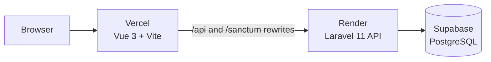

<div align="center">

# RateInfluencers

### Discover creators. Read real community feedback. Share thoughtful reviews.

A polished full-stack influencer discovery and review platform built with **Laravel 11**, **Vue 3**, and **Vite**.

[](https://laravel.com/)
[](https://vuejs.org/)
[](https://vite.dev/)
[](https://supabase.com/)
[](https://vercel.com/)
[](https://render.com/)

[Live Demo](https://rate-influencers.vercel.app) · [GitHub Repository](https://github.com/Lester-Fong/Rate-Influencers) · [Report an Issue](https://github.com/Lester-Fong/Rate-Influencers/issues)

</div>

---

## Preview

<table>
  <tr>
    <td width="50%">
      
    </td>
    <td width="50%">
      
    </td>
  </tr>
  <tr>
    <td align="center"><strong>Public creator discovery</strong></td>
    <td align="center"><strong>Administrator moderation portal</strong></td>
  </tr>
</table>

---

## About

**RateInfluencers** is a community-driven platform for discovering public content creators and reading moderated reviews about their work.

Visitors can browse influencer profiles, search by name, inspect public social links, read approved reviews, and submit a 1–5 star review. Administrators can manage influencer records, approve or reject submissions, and keep public ratings synchronized with approved community feedback.

The project is intentionally focused on a clean MVP:

- simple discovery;
- clear creator profiles;
- thoughtful written reviews;
- human moderation; and
- transparent rating calculation.

> Reviews are community opinions. They should focus on publicly available content and must not be used for harassment, private accusations, or personal attacks.

---

## Key Features

### Public experience

- Responsive influencer card grid
- Search by influencer name or slug
- Detailed influencer profile pages
- Public social media links
- Approved review listing
- Latest and top-rated review sorting
- 1–5 star review submission
- Pending moderation workflow
- Accurate average ratings and approved review counts
- Loading, empty, and error states
- Mobile-friendly responsive layout
- Accessible modal and keyboard navigation

### Administrator portal

- Secure Laravel Sanctum authentication
- Session restoration after browser refresh
- Protected dashboard and management routes
- Influencer create, edit, and delete actions
- Review status filtering
- Approve and reject moderation actions
- Automatic rating and review-count recalculation
- Responsive mobile sidebar
- Light and dark appearance modes
- Dashboard summary cards for moderation activity

### Data quality

- Curated real public influencer profiles
- Real public social links
- No fabricated ratings for seeded real creators
- Only approved reviews are visible publicly
- Ratings are controlled by the backend, not the client

---

## Rating and Moderation Rules

Every new review starts as:

```text
pending
```

Only reviews with an `approved` status:

- appear on public influencer pages;
- count toward the public review total; and
- affect the influencer's average rating.

The rating formula is intentionally simple:

```text
average rating = sum of approved review ratings / approved review count
```

Review moderation and aggregate recalculation run together in a database transaction.

---

## Tech Stack

### Backend

| Technology | Purpose |
|---|---|
| PHP 8.2+ | Backend runtime |
| Laravel 11 | API, validation, sessions, services, migrations |
| Laravel Sanctum | Stateful SPA authentication |
| Eloquent ORM | Database access and relationships |
| PHPUnit | Feature and domain tests |
| Docker | Reproducible Render deployment |

### Frontend

| Technology | Purpose |
|---|---|
| Vue 3 | User interface |
| Vite | Development server and production build |
| Vue Router | Public and protected navigation |
| Pinia | Shared application state |
| Axios | API and Sanctum requests |
| Tailwind CSS | Styling and responsive layout |
| SweetAlert2 | Confirmation and status dialogs |
| Vue Star Rating | Rating input and display |

### Infrastructure

| Service | Role |
|---|---|
| Vercel | Vue/Vite frontend hosting |
| Render | Dockerized Laravel API |
| Supabase | Production PostgreSQL database |
| GitHub | Source control and automatic deployments |
| MySQL / MariaDB | Local development database |

---

## Architecture



The browser uses the Vercel origin for both page and API requests. Vercel forwards `/api` and `/sanctum` traffic to Render, allowing Laravel Sanctum to provide cookie-based administrator authentication cleanly across the deployed SPA.

---

## Repository Structure

```text
Rate-Influencers/
├── backend/
│   ├── app/
│   │   ├── Http/
│   │   │   ├── Controllers/
│   │   │   ├── Requests/
│   │   │   └── Resources/
│   │   ├── Models/
│   │   └── Services/
│   ├── database/
│   │   ├── data/
│   │   ├── migrations/
│   │   └── seeders/
│   ├── docker/
│   ├── routes/
│   │   └── api.php
│   ├── tests/
│   └── Dockerfile
├── frontend/
│   ├── public/
│   ├── src/
│   │   ├── components/
│   │   ├── layout/
│   │   ├── lib/
│   │   ├── router/
│   │   ├── stores/
│   │   └── views/
│   ├── vercel.json
│   └── vite.config.js
└── README.md
```

---

## Local Development

### Prerequisites

Install:

- PHP 8.2 or newer
- Composer
- Node.js 18 or newer
- npm
- MySQL 8 or MariaDB
- Git

For Windows users, XAMPP can provide PHP and MySQL.

### 1. Clone the repository

```bash
git clone https://github.com/Lester-Fong/Rate-Influencers.git
cd Rate-Influencers
```

### 2. Configure the backend

```bash
cd backend
composer install
```

Create the environment file:

```bash
cp .env.example .env
```

PowerShell:

```powershell
Copy-Item .env.example .env
```

Generate the Laravel application key:

```bash
php artisan key:generate
```

Create a local database:

```sql
CREATE DATABASE rate_influencers;
```

Configure `backend/.env`:

```env
APP_NAME=RateInfluencers
APP_ENV=local
APP_DEBUG=true
APP_URL=http://127.0.0.1:8000
FRONTEND_URL=http://localhost:3000

DB_CONNECTION=mysql
DB_HOST=127.0.0.1
DB_PORT=3306
DB_DATABASE=rate_influencers
DB_USERNAME=root
DB_PASSWORD=

SESSION_DRIVER=file
SESSION_DOMAIN=
SESSION_SECURE_COOKIE=false
SESSION_SAME_SITE=lax

SANCTUM_STATEFUL_DOMAINS=localhost:3000,127.0.0.1:3000
CORS_ALLOWED_ORIGINS=http://localhost:3000,http://127.0.0.1:3000

CACHE_STORE=file
QUEUE_CONNECTION=sync

ADMIN_FULLNAME=Local Administrator
ADMIN_EMAIL=admin@example.com
ADMIN_PASSWORD=change-this-password
```

Run migrations and seed data:

```bash
php artisan migrate --seed
```

Start Laravel:

```bash
php artisan serve --host=127.0.0.1 --port=8000
```

Backend URL:

```text
http://127.0.0.1:8000
```

### 3. Configure the frontend

Open a second terminal:

```bash
cd frontend
npm install
npm run dev
```

Frontend URL:

```text
http://localhost:3000
```

Vite proxies local `/api` and `/sanctum` requests to Laravel at `http://127.0.0.1:8000`.

### 4. Open the administrator portal

```text
http://localhost:3000/login
```

Use the `ADMIN_EMAIL` and `ADMIN_PASSWORD` values configured before seeding.

---

## API Overview

### Authentication

| Method | Endpoint | Access |
|---|---|---|
| `GET` | `/sanctum/csrf-cookie` | Public |
| `POST` | `/api/v1/auth/login` | Public |
| `GET` | `/api/v1/auth/me` | Administrator |
| `POST` | `/api/v1/auth/logout` | Administrator |

### Public API

| Method | Endpoint | Purpose |
|---|---|---|
| `GET` | `/api/v1/influencers` | List or search influencers |
| `GET` | `/api/v1/influencers/{slug}` | Get influencer details |
| `GET` | `/api/v1/influencers/{slug}/reviews` | List approved reviews |
| `POST` | `/api/v1/influencers/{slug}/reviews` | Submit a pending review |

### Administrator API

| Method | Endpoint | Purpose |
|---|---|---|
| `GET` | `/api/v1/admin/influencers` | List influencer records |
| `POST` | `/api/v1/admin/influencers` | Create an influencer |
| `PATCH` | `/api/v1/admin/influencers/{id}` | Update an influencer |
| `DELETE` | `/api/v1/admin/influencers/{id}` | Delete an influencer |
| `GET` | `/api/v1/admin/reviews` | List reviews by status |
| `POST` | `/api/v1/admin/reviews/{id}/approve` | Approve a review |
| `POST` | `/api/v1/admin/reviews/{id}/reject` | Reject a review |

---

## Tests and Verification

### Backend

```bash
cd backend
php artisan test
```

Additional checks:

```bash
php artisan route:list
php artisan migrate:status
```

### Frontend

```bash
cd frontend
npm run build
```

### Production health check

```text
https://rate-influencers-api.onrender.com/up
```

---

## Deployment

Production is deployed through GitHub-connected services:

```text
Vue frontend   → Vercel
Laravel API    → Render
Database       → Supabase PostgreSQL
```

Important production values:

```env
APP_ENV=production
APP_DEBUG=false
SESSION_SECURE_COOKIE=true
RUN_MIGRATIONS=true
RUN_DB_SEEDER=false
```

The first production deployment may temporarily use:

```env
RUN_DB_SEEDER=true
ADMIN_FULLNAME=
ADMIN_EMAIL=
ADMIN_PASSWORD=
```

After the initial seed succeeds, `RUN_DB_SEEDER` should be returned to `false`.

Pushes to the production branch automatically trigger new deployments when auto-deploy is enabled on Vercel and Render.

---

## Security and Moderation Notes

- Never commit `.env` files.
- Never commit application keys, database passwords, or administrator credentials.
- Rotate any secret accidentally exposed in logs, screenshots, or Git history.
- Pending and rejected reviews must never be returned by public endpoints.
- `rating` and `review_count` are backend-controlled values.
- Administrator access is enforced by Laravel middleware, not only Vue navigation guards.
- Public reviews should discuss public content rather than private traits or personal allegations.

---

## Possible Future Enhancements

The current project is a completed MVP. Potential additions include:

- influencer categories and platform filters;
- visitor influencer recommendations;
- uploaded profile images;
- persisted helpful votes;
- registered reviewer accounts;
- creator profile claims;
- review reporting and appeals;
- richer search and analytics.

---

## Author

Built and maintained by **[Lester Fong](https://github.com/Lester-Fong)**.

<div align="center">

### Built with Laravel, Vue, and careful moderation.

</div>